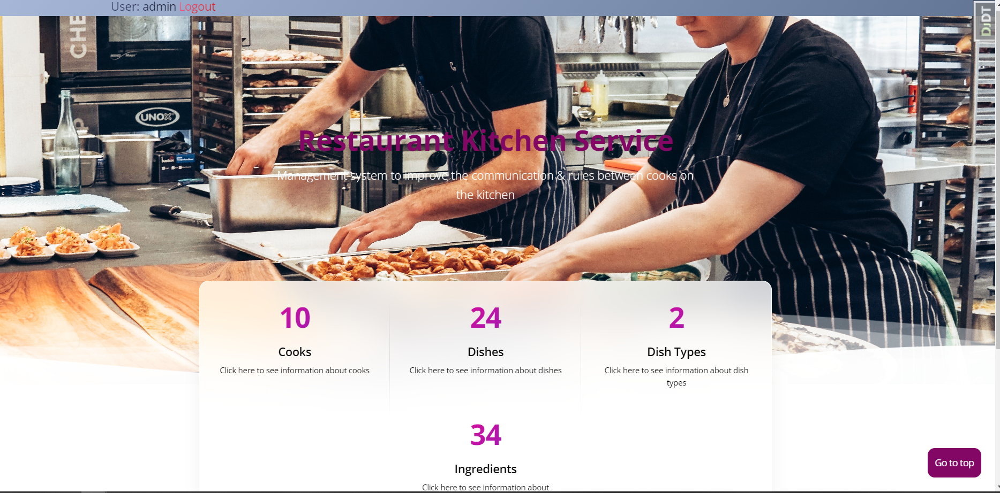

# Restaurant Kitchen Service Project

Django project for managing communication and rules between cooks on the kitchen.
* Manage the database of cooks, their personal data, the size of the contract and work experience
* Manage the database of ingredients, monitor where the selected ingredient is included, its purchase price and supplier.
* Manage the database of dishes, monitor which chef prepares the selected dish, the composition of the product, 
* Adjust the prices of ready-made dishes and monitor the marginality of dishes.


## Check it out!

[Restaurant kitchen service deployed to Render](https://restaurant-kitchen-service-3bui.onrender.com)

## Test user

login: admin
password: 1qazcde3

## Installation

Python3 must be already installed

``` shell
git clone https://github.com/olmatiash/restaurant-kitchen-service
cd restaurant-kitchen-service
python3 -m venv venv
source venv/bin/activate
pip install -r requirements.txt
python manage.py migrate
python manage.py runserver
```

## Features

* Authentication functionality for Author/User
* Managing dish cooks & dish types and ingredients directly from website interface
* Powerful admin panel for advanced managing

## Demo

